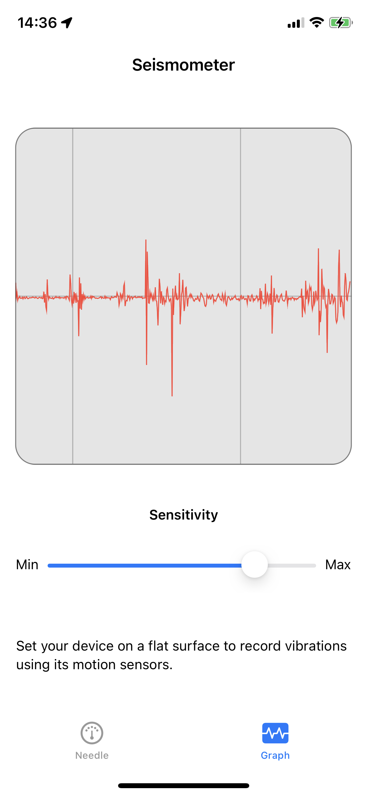
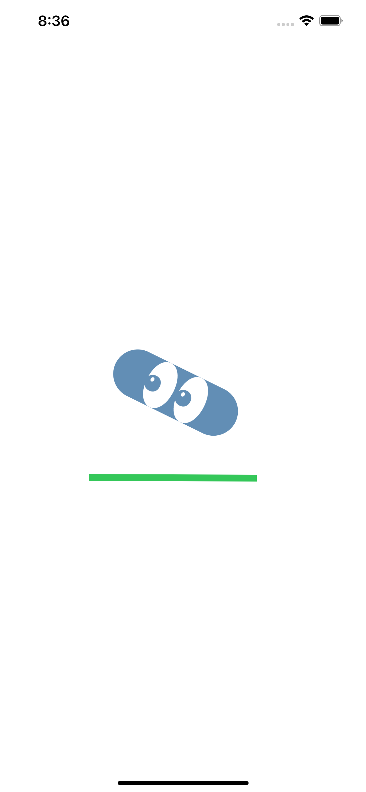
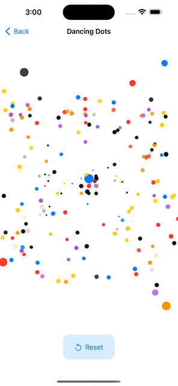

# swiftui-tutorials
Going through https://developer.apple.com/tutorials/sample-apps

Image | Tutorial | Learnings
--|--|--
 | [About me](https://developer.apple.com/tutorials/sample-apps/aboutme) | Tabs, Data model, modifiers, aspect ratios
 | [Choose your own story](https://developer.apple.com/tutorials/sample-apps/chooseyourownstory) | Navigation view, links, popping to root has many different solutions
 | [Date planner](https://developer.apple.com/tutorials/sample-apps/dateplanner) | StateObject, EnvironmentObject, foregroundStyle, Identifiable, split view navigation and placeholder labels, trailing commas on lists
 | [Organising with Grids](https://developer.apple.com/tutorials/sample-apps/organizingwithgrids) | Honeycomb grid layout
 | [Editing Grids](https://developer.apple.com/tutorials/sample-apps/editinggrids) | Dynamic number of items per row, Pluraliser, `EditButton`
 | [Image Gallery](https://developer.apple.com/tutorials/sample-apps/imagegallery) | `AsyncImage`, PhotoPicker, `Task { @MainActor in }` syntax
  | [Meme Creator](https://developer.apple.com/tutorials/sample-apps/memecreator) | `@MainActor` on class level warning and workaround, async await for network calls, `FetchError` enum for custom error handling, a11y on images
  | [Bubble Level](https://developer.apple.com/tutorials/sample-apps/bubblelevel) | CoreMotion, `beginGeneratingDeviceOrientationNotifications`, device orientation handling, blendModes `plusLighter` and `difference`, tuple declaration syntax `(roll, pitch) =`
 | [Seismometer](https://developer.apple.com/tutorials/sample-apps/seismometer) | `Canvas`, rotationEffect anchor, Slider min and max value labels
 | [Recognizing Gestures](https://developer.apple.com/tutorials/sample-apps/recognizinggestures) | `simultaneousGesture` to satisfy multiple conflicting gestures (magnify and rotation),  Tap, LongPress, Drag, Rotation Magnification gestures, `GestureState`,  randomize range syntax `CGFloat.random(in: 40...250)`
 | [Animating Shapes](https://developer.apple.com/tutorials/sample-apps/animatingshapes) | Experimentation with animations to create explosions, etc
